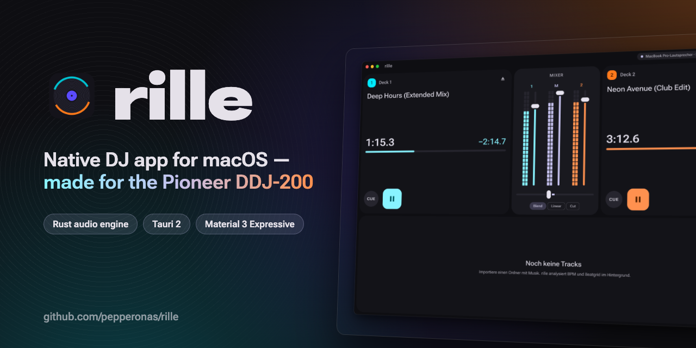
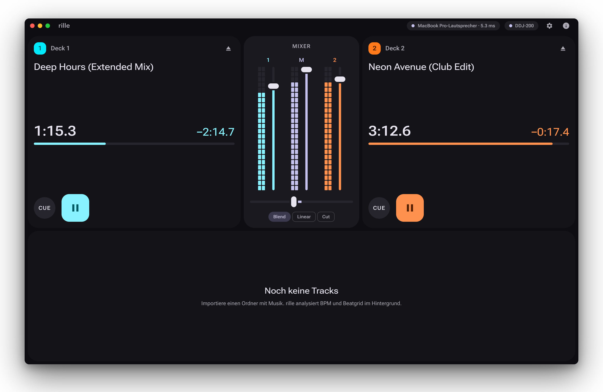
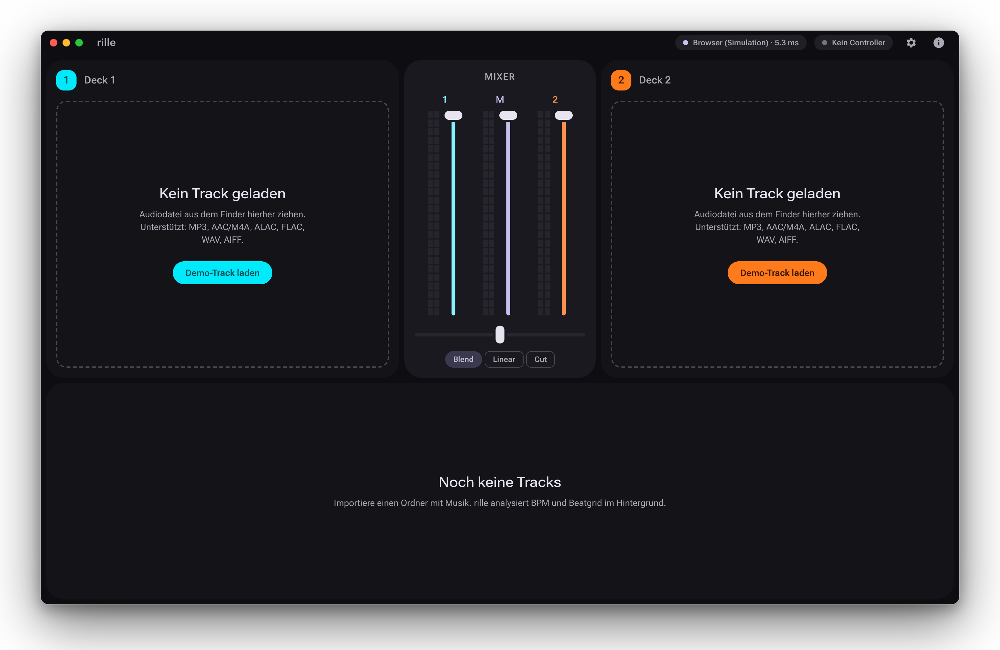
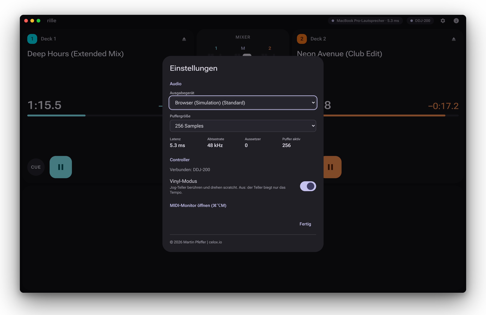
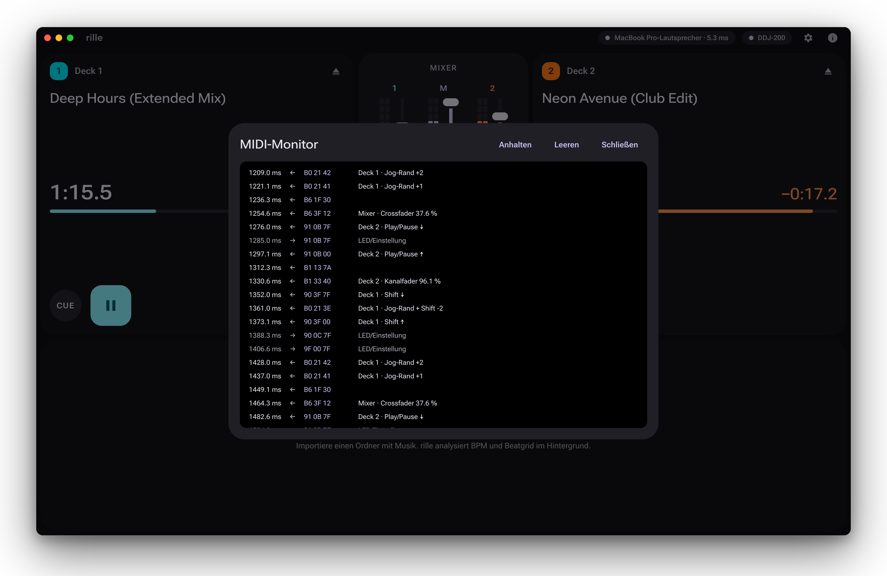

<div align="center">

<a href="https://github.com/pepperonas/rille"></a>

# 🎛️ rille

**English** · [Deutsch](README.de.md)

**A native DJ app for macOS with a realtime Rust audio engine, built around the Pioneer DDJ-200 — and fully playable with mouse and keyboard.**

<p>
  <a href="https://www.paypal.com/donate/?business=martin.pfeffer@celox.io&currency_code=EUR&item_name=rille"></a>
  &nbsp;
  <a href="https://g.page/r/CXgdRV3QysvxEBM/review"></a>
</p>

<!-- BADGES:BIG — computed by tools/stats.mjs, refreshed by CI on every push to main. -->
[](CHANGELOG.md)
[](#-testing)
[](#-project-structure)
[](#-testing)

</div>

<!-- Live numbers (same source, small) -->

[](crates)
[](src)
[](e2e)
[](crates)
[](src)
[](src)

<!-- Project status — GitHub badges update themselves. -->

[](https://github.com/pepperonas/rille/actions/workflows/ci.yml)
[](https://github.com/pepperonas/rille/tags)
[](https://github.com/pepperonas/rille/commits/main)
[](https://github.com/pepperonas/rille/commits/main)
[](#-project-structure)
[](https://github.com/pepperonas/rille)
[](https://www.rust-lang.org)
[](https://github.com/pepperonas/rille/issues)
[](https://github.com/pepperonas/rille/stargazers)
[](LICENSE)
[](https://celox.io)

<!-- Platform & runtime -->

[](#-getting-started)
[](#-getting-started)
[](#-audio-engine)
[](#%EF%B8%8F-pioneer-ddj-200)
[](#-performance)
[](#-features)
[](#%EF%B8%8F-pioneer-ddj-200)

<!-- Language, build & toolchain -->

[](https://www.rust-lang.org)
[](https://tauri.app)
[](https://react.dev)
[](https://www.typescriptlang.org)
[](https://vite.dev)
[](https://pnpm.io)
[](https://github.com/RustAudio/cpal)
[](https://github.com/pdeljanov/Symphonia)
[](https://github.com/HEnquist/rubato)
[](https://github.com/mgeier/rtrb)
[](https://github.com/Boddlnagg/midir)

<!-- Design -->

[](https://m3.material.io)
[](#-design)
[](#-design)
[](https://fonts.google.com/specimen/Roboto+Flex)
[](#-design)

<!-- Engineering practice -->

[-2E9E5B?logo=rust&logoColor=white)](#-audio-engine)
[](.github/workflows/ci.yml)
[](Cargo.toml)
[](e2e)
[](src)
[](https://www.conventionalcommits.org)
[](https://semver.org)
[](CHANGELOG.md)
[](#-contributing)

<!-- What rille deliberately does not do -->

[](#-design)
[](#-design)
[](#-design)
[-2E7D32)](#-architecture)

> **Status: early development (v0.1.0).** Two decks play files dropped from the Finder, with
> Pioneer-style cue, channel faders, crossfader and meters — controllable with mouse, keyboard
> and the DDJ-200. EQ, filter, tempo/keylock, the library, waveforms and beat features follow
> milestone by milestone (see [Roadmap](#%EF%B8%8F-roadmap)). There is no packaged release yet.

---

## Table of contents

- [📸 Screenshots](#-screenshots)
- [✨ Features](#-features)
- [🎛️ Pioneer DDJ-200](#%EF%B8%8F-pioneer-ddj-200)
- [⌨️ Mouse and keyboard](#%EF%B8%8F-mouse-and-keyboard)
- [🚀 Getting started](#-getting-started)
- [🔊 Audio engine](#-audio-engine)
- [🏛️ Architecture](#%EF%B8%8F-architecture)
- [🎨 Design](#-design)
- [📏 Performance](#-performance)
- [🧪 Testing](#-testing)
- [🗂️ Project structure](#%EF%B8%8F-project-structure)
- [🗺️ Roadmap](#%EF%B8%8F-roadmap)
- [🧯 Troubleshooting](#-troubleshooting)
- [🤝 Contributing](#-contributing)
- [❤️ Support](#%EF%B8%8F-support)
- [📄 License](#-license)

---

## 📸 Screenshots

<p align="center">
  
</p>

| First start | Settings | MIDI monitor |
|:---:|:---:|:---:|
|  |  |  |
| Empty states say what to do next | Device, buffer, latency, dropouts, controller | Every MIDI message, decoded, live (⌘⌥M) |

<sub>Screenshots are rendered from the in-browser demo (`pnpm screenshots`), so they are
reproducible without hardware. The MIDI traffic in the monitor shot is simulated.</sub>

## ✨ Features

**Available now**

- **Two decks** — drop an audio file from the Finder onto a deck; title, elapsed and remaining
  time (tabular digits, readable from two metres), progress line, eject.
- **Pioneer-style cue** — paused: set the cue point; hold on the cue point to preview and
  release to return; press Play while holding to keep playing; while playing: back to cue and
  pause. Shift + Cue jumps to the start.
- **Mixer** — channel faders with a DJ taper, master level, crossfader with three curves
  (Blend = constant power, Linear, Cut for scratching), segmented peak meters per channel and
  master.
- **Click-free transport** — stop, start, cue jumps and seeks crossfade over 4 ms instead of
  cutting the waveform.
- **Audio settings** — output device, buffer size 64–2048, measured latency, dropout counter;
  unplugging the interface switches to the system default without stopping the set.
- **Formats** — MP3, AAC/M4A, ALAC, FLAC, WAV, AIFF; resampled to the engine rate on load.
- **Pioneer DDJ-200** — plug and play, LED feedback, soft takeover, vinyl mode, MIDI monitor
  (details [below](#%EF%B8%8F-pioneer-ddj-200)).
- **Material 3 Expressive UI** — dark first, per-deck accent colours, spring motion, the play
  button morphs between circle and rounded square.

**Coming next** — EQ with kill, bipolar filter and transition FX (M3), tempo/keylock/scratch
(M4), library with BPM and beatgrid analysis (M5), waveforms (M6), sync, hot cues, loops and
pads (M7), headphone cueing (M8). See the [Roadmap](#%EF%B8%8F-roadmap).

## 🎛️ Pioneer DDJ-200

rille detects the DDJ-200 when it is plugged in (USB-MIDI; the DDJ-200 has no audio interface,
so sound goes to the selected macOS output). The controller status is in the title bar; vinyl
mode and the MIDI monitor are in the settings.

| Control | Function | With Shift | Status |
|---|---|---|---|
| Play/Pause | Start / stop | Reverse while held | ✅ / M4 |
| Cue | Pioneer cue (set, preview, back) | Jump to track start | ✅ |
| Channel fader | Level | Fader start: up = play, back to zero = return to cue | ✅ |
| Crossfader | Blend (curve chosen in the app) | — | ✅ |
| Jog touch + platter | Scratch (vinyl mode) | Fast search | M4 |
| Jog rim | Pitch bend | Browse the library | M4 / M5 |
| Tempo fader | Tempo (top = slower, as printed) | — | M4 |
| Beat Sync | Short: sync · long: sync lock | Cycle tempo range (±6/10/16 %/wide) | M7 |
| EQ Hi / Mid / Low | Three-band isolator EQ | — | M3 |
| CFX | Bipolar filter (left low-pass, right high-pass) | — | M3 |
| Headphone cue | Pre-listen the channel | Load the selected track | M8 / M5 |
| Master cue | Master in the headphones | — | M8 |
| Transition FX | Echo-out on the active deck | Change effect | M3 |
| Pads 1–8 | Hot cue / beat loop / beat jump | Delete / exit loop | M7 |

**How the controller is handled**

- **Mapping is a table.** All bytes of the device live in one file
  ([`ddj200/table.rs`](crates/rille-midi/src/ddj200/table.rs)), checked by a test against every
  row of Pioneer's *DDJ-200 List of MIDI messages* typed in independently.
- **14-bit faders and knobs** — MSB and LSB are combined, the value is taken when the LSB
  arrives.
- **Shift is tracked** — the jog rim and the faders send the same message with and without
  Shift.
- **Soft takeover** — after reconnecting, or after a value was changed in the app, a hardware
  control only takes over once it reaches the current value. Nothing jumps mid-set.
- **LEDs** — Play blinks on a loaded, paused deck, Cue blinks away from the cue point, Loaded
  lights up when a track is on the deck. Only changes are sent; everything is resent on
  connect.
- **Vinyl mode** — on by default, switchable in the settings; sent to the controller on connect.

> [!NOTE]
> The PDF is ambiguous in one place: its channel table lists the mixer/effect section on MIDI
> channel 5, while every message row uses channel 7 (`B6`/`96`). rille follows the message rows;
> the MIDI monitor confirms it on real hardware. The PDF itself is copyrighted by Pioneer DJ and
> therefore not part of this repository.

**Without hardware:** `cargo run -p rille-midi --example virtual_ddj` starts a virtual DDJ-200
(CoreMIDI virtual ports) next to the running app; rille connects to it like to the real device.

## ⌨️ Mouse and keyboard

Everything works without a controller:

| Action | How |
|---|---|
| Load a track | Drop an audio file from the Finder onto a deck |
| Play / Pause, Cue | Click, or focus the button and press Space / Enter (Cue: hold to preview) |
| Jump to start | Shift + click on Cue |
| Faders | Drag; arrow keys (Shift = larger steps), Home / End; double-click resets |
| Crossfader curve | Blend / Linear / Cut chips under the crossfader |
| Settings | ⚙︎ in the title bar, or click the audio / controller status |
| MIDI monitor | ⌘⌥M |

Global shortcuts for the decks (and a `?` overview) arrive with M9.

## 🚀 Getting started

**Requirements:** macOS 13 or newer (Apple Silicon recommended), Rust stable with the Xcode
Command Line Tools, Node.js 22 and pnpm 10.

```bash
git clone https://github.com/pepperonas/rille.git
cd rille
pnpm install          # frontend dependencies, including the local Tauri CLI
pnpm tauri dev        # build and start the app
```

| Command | What it does |
|---|---|
| `pnpm tauri dev` | Start the app (Vite on :1420 + Rust, hot reload) |
| `pnpm dev` | UI only, in the browser, against a simulated backend (`?demo` for a lively state) |
| `pnpm check` | Everything CI runs: build, typecheck, ESLint, Vitest, rustfmt, Clippy, cargo test |
| `pnpm e2e` | Playwright tests against the simulated backend (uses the installed Chrome) |
| `pnpm badges` | Recompute the README numbers (`.github/badges/*.json`) |
| `pnpm screenshots` | Re-render `docs/screenshots/*` and `docs/banner.png` |
| `pnpm tokens` | Regenerate the colour tokens after changing a seed colour |
| `pnpm tauri build` | Build `rille.app` / `.dmg` (unsigned for now) |

## 🔊 Audio engine

- **Realtime rules.** The CoreAudio callback never allocates, locks, logs or does I/O. A test
  renders 2,000 blocks under [`assert_no_alloc`](https://crates.io/crates/assert_no_alloc) —
  and a counter-check proves the guard would notice an allocation. Debug builds of the app abort
  loudly if the callback ever allocates.
- **Lock-free in and out.** The UI and the controller each have their own
  [`rtrb`](https://crates.io/crates/rtrb) command queue; the engine publishes its state through a
  triple buffer (newest wins, no back-pressure). Replaced tracks travel back through a garbage
  queue, so memory is never freed on the audio thread.
- **Testable without a device.** `Engine::process(&mut out, channels)` knows nothing about
  cpal; tests render offline and measure.
- **Smoothing everywhere.** Faders and crossfader are smoothed per sample (time-based), so
  moves never zipper. Curves: channel fader squared (−12 dB at half), crossfader constant power
  / linear / cut.
- **Declick.** Stops, starts, cue jumps and seeks become 4 ms fades or crossfades.
- **Device changes.** A wait-free `EngineSlot` hands the engine from one output stream to the
  next, so loaded tracks, positions and cue points survive a device switch. cpal reports errors
  partly on the render thread and every CoreAudio overload as an "xrun" error — rille only
  touches atomics there, counts overloads, and rebuilds the stream only when it is really
  broken (falling back to the default device if the old one vanished).
- **Decoding** with [symphonia](https://github.com/pdeljanov/Symphonia), resampling with
  [rubato](https://github.com/HEnquist/rubato) (FFT), bounded to 1 h / 200 M frames and
  8–384 kHz so a broken header cannot exhaust memory.

## 🏛️ Architecture

```
 React UI ──commands──▶ src-tauri ──rtrb──▶ ┌──────────────────────────┐
    ▲                     │                 │ rille-engine             │ CoreAudio
    │ 60 Hz state frames  │ AudioService    │ Engine::process (RT)     ├──────────▶ output
    └──── Tauri channel ◀─┤ bridge thread ◀─┤ triple buffer · events   │
                          │                 └──────────────────────────┘
 DDJ-200 ◀── LEDs ──── ControllerService ──rtrb──▶ (own command queue)
   USB-MIDI ───────────▶ rille-midi: table → decoder → soft takeover → mapping
                          rille-library: decode (symphonia) · resample (rubato)
```

| Thread | Job | Allowed |
|---|---|---|
| Main (AppKit/Tauri) | windows, commands, first CoreMIDI client | everything except blocking |
| Audio (CoreAudio) | `Engine::process`, queues, snapshot | lock- and allocation-free work only |
| Bridge (60 Hz) | state frames to the UI, garbage, stream health | normal |
| Controller | MIDI in → engine commands, engine state → LEDs, hotplug | normal |
| Loader | decode + resample, hand tracks to the engine | normal |

- **IPC:** typed Tauri commands for actions; a `Channel` streams state frames at up to 60 Hz and
  only while something changes or plays (0 Hz when idle). The UI extrapolates positions between
  frames, so time readouts run at display rate (120 Hz on ProMotion).
- **Security:** strict CSP (no remote content, fonts bundled), minimal Tauri capabilities.
- The frontend never computes anything audio-relevant; a mock backend with the same interface
  runs the UI in a normal browser for development and tests.

## 🎨 Design

- **Material 3 Expressive**, dark first. Colours are generated from one seed plus one accent
  per deck (cyan / orange) with
  [material-color-utilities](https://github.com/material-foundation/material-color-utilities);
  a test checks text contrast (≥ 4.5:1) and accent visibility (≥ 3:1) in both themes.
- **Tokens are the single source of truth** (`src/design/tokens.css`); a test fails if a
  component stylesheet contains a raw pixel value or colour.
- **Motion** uses springs only; effect springs never overshoot (tested), and
  `prefers-reduced-motion` turns animations off.
- **Roboto Flex** variable font, bundled locally; emphasized width for times and titles.
- **Private by design:** no network access, no tracking, no account.

## 📏 Performance

| Budget | Target | Measured so far |
|---|---|---|
| Buffer | 256 frames @ 48 kHz without dropouts | 256 frames fixed, 0 xruns (MacBook, idle) |
| Output latency | — | 5.3 ms (buffer + device) |
| Idle CPU | minimal | 0.2 % (debug build, nothing playing) |
| Decode + resample a 3:43 MP3 | track load < 300 ms (analysed tracks) | ~360 ms (release) — a PCM cache arrives with the library (M5) |
| Controller → audible | < 10 ms (without device latency) | one audio block (≤ 5.3 ms) + MIDI |

## 🧪 Testing

The badges at the top are measured, not typed: `tools/stats.mjs` counts the tests and lines,
and CI commits new numbers whenever they change.

| Suite | Where | Highlights |
|---|---|---|
| Rust unit + integration | `crates/*/src`, `crates/*/tests`, `src-tauri/src` | cue state machine, curves, smoothing, declick, meters, measured EQ/filter frequency responses, decoder edge cases, every PDF row of the DDJ-200, 14-bit/jog/shift decoding, soft takeover incl. reconnect and fast sweeps |
| Allocation guard | `crates/rille-engine/tests/no_alloc.rs` | 2,000 blocks under `assert_no_alloc`, plus a counter-check that a planted allocation is caught |
| CoreMIDI round trip | `crates/rille-midi/tests/virtual_roundtrip.rs` | virtual DDJ-200 → port → decoder → action, and LEDs back |
| Frontend (Vitest) | `src/**/*.test.ts`, `scripts`, `tools` | store and load races, position extrapolation, token sync and contrast, "no raw values" guard |
| E2E (Playwright) | `e2e/` | load, play, cue, eject, keyboard operation, faders, settings, controller UI — against the mock backend |

Practices: Clippy with `-D warnings`, `unwrap`/`expect`/`panic` denied outside tests, and new
guards are mutation-checked (the test is run once against deliberately broken code to prove it
fails).

```bash
pnpm check   # what CI runs
pnpm e2e     # browser tests
```

## 🗂️ Project structure

```
rille/
├── crates/
│   ├── rille-core/      shared types: DeckId, Command, Snapshot, TrackAudio
│   ├── rille-engine/    realtime engine, DSP, cpal output, EngineSlot
│   ├── rille-midi/      DDJ-200 table, decoder, mapping, soft takeover, LEDs, ports, virtual DDJ
│   └── rille-library/   decoding and resampling (library + analysis follow in M5)
├── src-tauri/           app shell: AudioService, ControllerService, commands, bridge
├── src/                 React UI: deck/, mixer/, settings/, dev/, design/, ipc/, state/
├── e2e/                 Playwright tests
├── tools/               stats (badges), screenshots, banner and window frame
├── scripts/             colour token generator
├── docs/                banner, screenshots, plans (docs/superpowers/plans)
└── .github/             CI and badge data
```

## 🗺️ Roadmap

| Milestone | Content | Status |
|---|---|---|
| M0 | Foundation: workspace, Tauri shell, tokens, CI | ✅ |
| M1 | Engine core: playback, cue, mixer, meters, devices | ✅ |
| M2 | Pioneer DDJ-200: mapping, LEDs, takeover, hotplug, monitor | ✅ (hardware acceptance pending) |
| M3 | Isolator EQ with kill, bipolar filter, transition FX (echo-out) | 🚧 DSP done |
| M4 | Tempo ranges, keylock (Signalsmith Stretch), pitch bend, scratch, reverse | ⏳ |
| M5 | Library: import, SQLite, BPM/beatgrid analysis, search, drag & drop | ⏳ |
| M6 | Waveforms (overview + scrolling detail, frequency colours), deck UI | ⏳ |
| M7 | Sync & sync lock, hot cues, beat loops, beat jump, pad modes | ⏳ |
| M8 | Headphone cueing on a second device or a 4-channel interface | ⏳ |
| M9 | Full keyboard control, light theme, empty states, measured budgets | ⏳ |

Later: key detection, more effects, recording, sampler pads.

## 🧯 Troubleshooting

**No sound / "Kein Audio-Gerät".** Open the settings and pick an output. rille runs at 48 kHz
(44.1 kHz if the default device cannot); a device that supports neither reports a clear error.

**The DDJ-200 is not detected.** Use a data-capable USB cable and check that the controller
appears in *Audio MIDI Setup → MIDI Studio*. rille polls once per second; the MIDI monitor
(⌘⌥M) shows whether messages arrive.

**Dropouts.** The dropout counter is in the settings. Raise the buffer size (512 or 1024), and
close apps that use the same audio device.

**A fader on the controller does nothing.** Soft takeover: move it past the value shown in the
app, then it takes over.

## 🤝 Contributing

Issues and pull requests are welcome. Please read [`CLAUDE.md`](CLAUDE.md) and the rules in
[`.claude/rules/`](.claude/rules) (realtime audio, MIDI mapping, design) first; run
`pnpm check` and `pnpm e2e` before opening a PR. Commits follow
[Conventional Commits](https://www.conventionalcommits.org). No code from GPL projects (for
example the Mixxx mappings) may be copied into rille.

Changes are listed in the [changelog](CHANGELOG.md).

## ❤️ Support

rille is free, open source and built in the evenings by one person. If it makes your sets
better, a coffee or a review helps a lot:

<a href="https://www.paypal.com/donate/?business=martin.pfeffer@celox.io&currency_code=EUR&item_name=rille"></a>
<a href="https://g.page/r/CXgdRV3QysvxEBM/review"></a>

- ☕ **Donate** via PayPal: [martin.pfeffer@celox.io](https://www.paypal.com/donate/?business=martin.pfeffer@celox.io&currency_code=EUR&item_name=rille)
- ⭐ **Rate celox.io** on Google Maps: [g.page/r/CXgdRV3QysvxEBM/review](https://g.page/r/CXgdRV3QysvxEBM/review)
- 🌟 Star the repo, report issues, send PRs — just as welcome.

## 📄 License

[MIT](LICENSE) © 2026 Martin Pfeffer · [celox.io](https://celox.io)

**Third-party components:** Roboto Flex (SIL Open Font License 1.1),
material-color-utilities (Apache 2.0, build time only), and the Rust and npm dependencies
listed in `Cargo.lock` and `pnpm-lock.yaml` under their own licenses. Pioneer DJ and DDJ-200 are
trademarks of their respective owners; rille is not affiliated with or endorsed by them.
